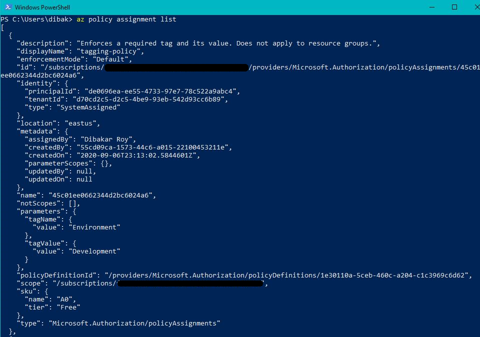
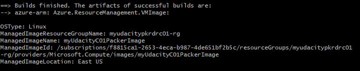
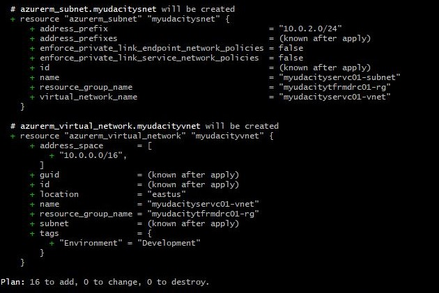
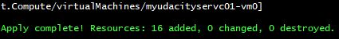

# Azure Infrastructure Operations Project: Deploying a scalable IaaS web server in Azure

### Introduction
For this project, you will write a Packer template and a Terraform template to deploy a customizable, scalable web server in Azure.

### Getting Started
1. Clone this repository.

2. Create your infrastructure as code.
The main steps under this are as follows:
    * Creating a Packer template
    * Creating a Terraform template
    * Deploying the infrastructure

3. Update this README to reflect how someone would use your code.

### Dependencies
1. Create an [Azure Account](https://portal.azure.com) 
2. Install the [Azure command line interface](https://docs.microsoft.com/en-us/cli/azure/install-azure-cli?view=azure-cli-latest)
3. Install [Packer](https://www.packer.io/downloads)
4. Install [Terraform](https://www.terraform.io/downloads.html)

### Instructions

## Step 1: Create and Apply a Tagging Policy
Create a policy that ensures all indexed resources in your subscription have tags and deny deployment if they do not.
* Write a policy definition to deny the creation of resources that do not have tags.
* Apply the policy definition to the subscription with the name "tagging-policy.
* Use 'az policy assignment list' and take the snapshot of your policy [Please refer to Screenshot 1 in the Output section].

## Step 2: Create a Server Image Template
Create a server image using Packer that anyone can use and leverage in the Terraform template ensuring the following:
* Use an Ubuntu 18.04-LTS SKU as base image.
* Add the bulders code in the server.json file provided in the starter folder.
* The resource group that you'll specify in the Packer for image is the same image specified in Terraform.

## Step 3: Create the infrastructure Terraform Template
* Create a Resource Group.
* Create a Virtual network and a subnet on that virtual network.
* Create a Network Security Group. Ensure that you explicitly allow access to other VMs on the subnet and deny direct access from the internet.
* Create a Network Interface.
* Create a Public IP.
* Create a Load Balancer. Your load balancer will need a backend address pool and address pool association for the network interface and the load balancer.
* Create a virtual machine availability set.
* Create virtual machines. Make sure you use the image you deployed using Packer!
* Create managed disks for your virtual machines.
* Ensure a variables file allows for customers to configure the number of virtual machines and the deployment at a minimum.

## Step 4: Deploying the infrastructure
Now that your Packer and Terraform templates are written, it's time to deploy your work. Using a service principal or your own administrator account in Azure, you'll want to deploy your VM image using Packer.

Once your image is successfully deployed, you'll use Terraform to deploy your infrastructure (making sure to run terraform plan with the -out flag, and save the plan file with the name solution.plan) and ensure the following:
* Run 'packer build' on your Packer template with any appropriate variable arguments [Please refer to Screenshot 2 in the Output section].
* Run 'terraform plan -out solution.plan' [Please refer to Screenshot 3 in the Output section].
* Deploy your Terraform infrastructure by running 'terraform apply' [Please refer to Screenshot 4 in the Output section] and don't forget to terraform destroy it once you're done!.


### Output
## Screenshot 1: Tagging Policy
Please see the snapshot of the tagging-policy mentioned below:


## Screenshot 2: Packer Image
Please see the snapshot of the successful packer image build mentioned below:


## Screenshot 3: Terraform Plan
Please see the snapshot of the successful 'terraform plan' command mentioned below:


## Screenshot 4: Terraform Apply
Please see the snapshot of the successful 'terraform apply' command to deploy the infrastructure mentioned below:



### The files included are:
```sh
* /project-snapshots: Folder containing the screenshots the results
* main.tf: File containing the Terraform infrastructure template
* vars.tf: File containing the variables to be used in the Terraform infrastructure template
* server.json: File containing the Packer image template
```